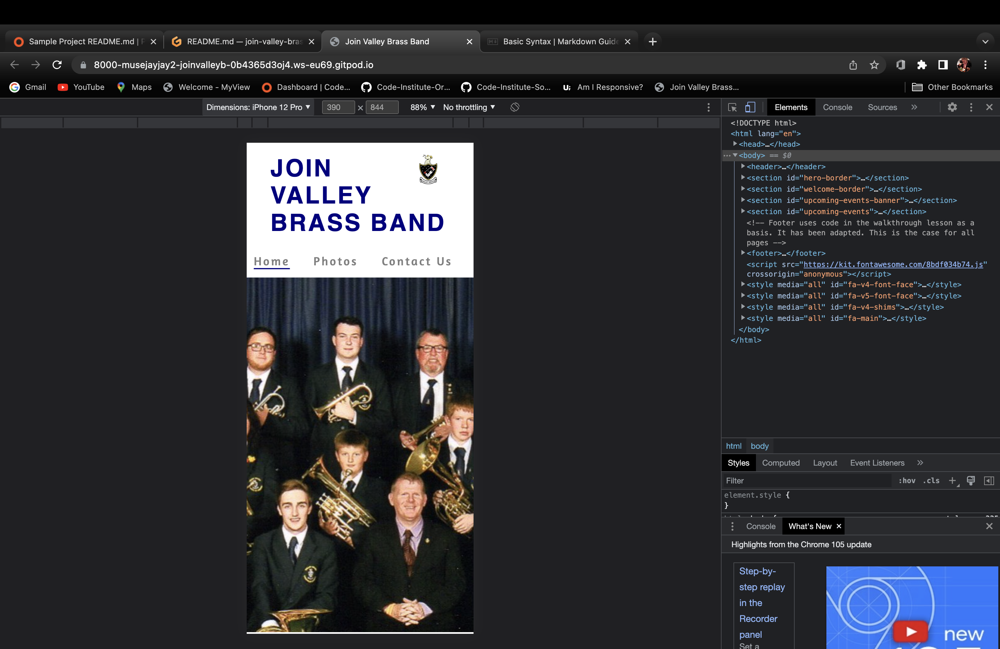

# Join Valley Brass

The Join Valley Brass website is designed to give information about the brass band, why it is beneficial to be part of one and offer the opportunity to contact the band to tell them of your interest in the organisation.

The website shows information important to this goal; showing why being in a brass band is a good thing, detailing where valley brass is performing soon so prospective members can go and see the band in action and images of the band and logo to develop awareness of the brand. 

You can see the home screen on multiple devices here using dev tools - 

# Features 

1.	Navigation

The navigation menu is set at the top of the page. The left hand side has the band’s logo as well as the page logo in the bands colours of navy blue. This logo also links to the home page.

The navigation links are set to the right of the page, these link to separate pages for each link. The links are set to a grey colour to contrast the white background and have an underlining for which page you are currently on in the bands colour of navy blue.

The nav bar is responsive and the same throughout the website’s different pages. It has a consistent colour scheme and font as well as appropriate sizing and spacing. This allows the user to clearly see the nav links and to understand what they do and what they will see when they click them.

2.	Hero Image

The landing page has a hero image, this depicts the band at a national finals championships. Its main purpose is to put faces to the organisation, people can see other members, they can see they are dressed smartly and proud to be a part of the organisation and it shows the success the band have had.

The image has a slight zoom upon loading that helps add a touch of interest to the user.

3.	Why Join Valley Brass?

This section details 4 reasons why users should consider joining the band. They are organised into two sections, left and right with a centre image. 

The section continues the colour theme of navy, grey and white. Headings in the biggest contrast colour, navy and paragraphs in grey. I feel this helps the user to be drawn in by the headings and invites users to read on through the paragraph.

Each header has its own icon as a way to add a little bit more interest to the page and is underlined to again help draw attention of the user.

The centre image is the band’s logo, continuing the theme from the navigation bar.

4.	Upcoming Events

This section is designed to detail upcoming band events that users may want to consider attending to listen to us before joining.

The section is split into 4 sections each with its own header which corresponds to the type of band playing. Underneath is the venue, date and time of the event which have borders to help segregate the information in an easier to digest format.

The background is another image of the band, this time a more relaxed image. It is positioned to show the faces of the members but also to provide a less busy image behind the text at the top of these sections.

5.	Footer

The footer is important to allow links to the band’s social media accounts. These are all active and linked correctly to the corresponding accounts of the organisation. The layout is very similar to that of the love running footer as it was exactly as clean and focused as I wanted for my project.

I did adapt sizing as well as icon colour to help it better fit into the colour scheme of the website.

All of the links open in a new tab as not to divert attention of the user.

6.	Photos page

The photos page allows users to see more photos of the organisation in various situations, some more casual and some more formal. This page is designed to build on the intent of the hero image, adding faces to the organisation and to show off the bands accomplishments.

This section is styled very similarly to the love running project as in my research this is a very clean and elegant way of presenting the images.

7.	Contact us page

This page has the form to submit a request to join the band. The form gathers data of use for this purpose, with a focus on the user information first, then more information about what band they are interested in joining and then a text box to allow the user to add specific and unique comments for consideration by the organisation.

The form as different types of inputs all appropriate for the question they are adhering to.

Questions that are needed are set as required, and questions that are tertiary are not.

I have kept the page simple so as not to distract from the main purpose of it. The colour scheme is in keeping with the rest of the website and the organisation itself.

# Features left to implement – 

1.	I would like to add a zoom on focus mechanic to the photos page to help distinguish the photo the user is currently looking at. I did play around with this although it became too complicated and time consuming and I felt it would be better to add it to a following release.

2. I would also like to implement a feedback message for submission of the form on the form page.

# Testing

1. I tested the website works on different browsers - google chrome, firefox, safari and edge.

2. I confirmed that the website is responsive and looks good on all three screen sizes, desktop, tablet and mobile. I did this using the google dev tools.

3. I confirmed that all aspects of the pages are readable and easy to understand

4. I have confirmed that the form works, requiring inputs where appropriate

# Bugs

No bugs have been found currently

# Validator testing

1. HTML - no errors were found when running the pages through the w3c validator. There were a couple of suggestions.

2. CSS - no errors were found when running the css page through the jigsaw validator.

3. Accessibility - I have confirmed that colours and fonts are easy to read using lighthouse within dev tools.

# Deployment

The site was deployed using github pages by -

1. In the correct github repository, cliking on settings

2. Then clicking the pages section on the left hand side

3. Making sure it is deployed form a branch

4. Selcting the main branch below this and clicking save

# Credits 

1. The footer is heavily inspired by the CI love running project but adapted in style to better fit this use case.

2. The photos page uses the gallery page form the CI love running project as a basis.

# Media

The images on the site are all used by consent from Valley Brass Band.

The icons are from fontawesome.com

